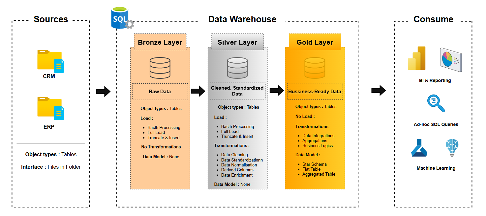
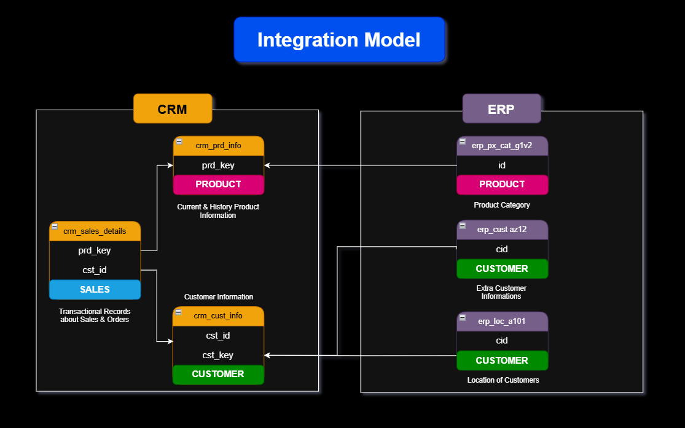
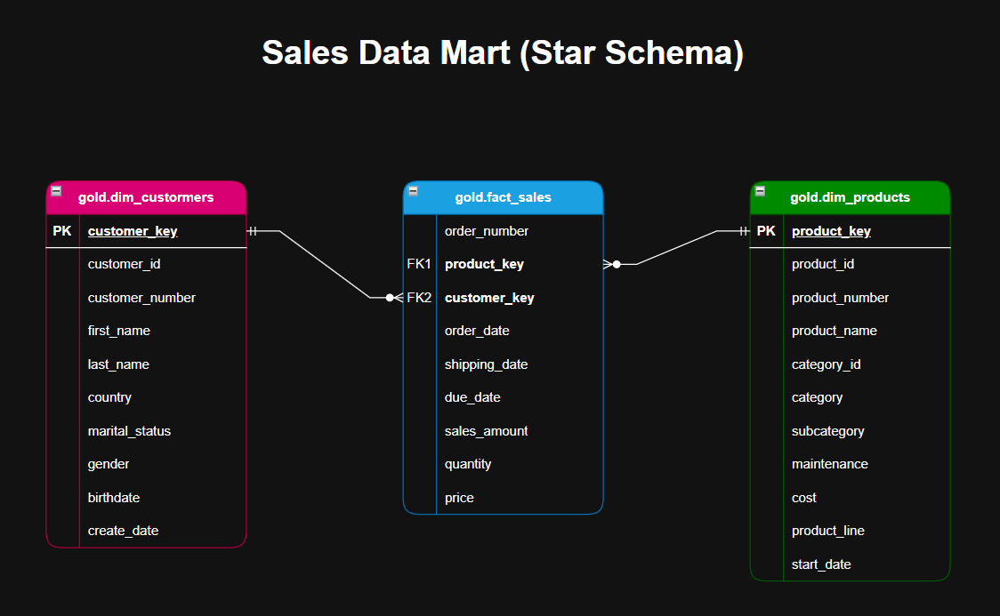

# SQL Server Data Warehouse Project

## Overview
This repository contains a guided end‑to‑end **Data Warehouse** implementation on **SQL Server**, using a layered **Bronze → Silver → Gold** approach.

The project covers:
- Ingesting source data (CSV) from **CRM** and **ERP**
- Building a raw landing area (**Bronze**)
- Cleaning, standardizing, and validating data (**Silver**)
- Publishing an analytical **Star Schema** (**Gold**) for reporting and analysis

---

## Architecture (Bronze → Silver → Gold)


### Bronze (Raw)
- **Goal:** keep the source structure with minimal changes
- **Load pattern:** full load (TRUNCATE + INSERT)
- **Transformations:** none (raw storage)
- **Notes:** includes technical/lineage columns (run id, source file, load timestamp)

### Silver (Cleaned & Standardized)
- **Goal:** produce reliable, standardized datasets
- **Typical rules:** trimming text, normalizing categories, validating dates, handling nulls, resolving duplicates
- **Load pattern:** full load (TRUNCATE + INSERT) in this project

### Gold (Business Model)
- **Goal:** business‑ready analytical model
- **Output:** **Star Schema** (dimensions + fact)
- **Use cases:** BI dashboards, ad‑hoc SQL, analytics

---

## Data Flow


High‑level pipeline:
1. CSV files (CRM/ERP) → **Bronze tables**
2. Bronze → **Silver tables** (cleaning + standardization)
3. Silver → **Gold model** (dimensions + fact)
4. Gold → BI / reporting / analysis

---

## Source Integration Model


### Source tables
**CRM**
- `crm_sales_details` (sales)
- `crm_cust_info` (customer)
- `crm_prd_info` (product)

**ERP**
- `erp_px_cat_g1v2` (product category)
- `erp_cust_az12` (customer enrichment)
- `erp_loc_a101` (customer location)

### Key relationships used for enrichment
- Customer enrichment: `crm_cust_info.cst_key = erp_cust_az12.cid`
- Customer location: `crm_cust_info.cst_key = erp_loc_a101.cid`
- Product category: `crm_prd_info.cat_id = erp_px_cat_g1v2.id`

---

## Gold Layer (Sales Data Mart - Star Schema)


### Dimensions
- `gold.dim_customers` — 1 row per customer (customer attributes + enrichment)
- `gold.dim_products` — 1 row per current product (product attributes + categories)

### Fact
- `gold.fact_sales` — 1 row per sales order line (amount, quantity, price), linked to the two dimensions.

---

## Data Quality Controls (Silver)
Examples of validations applied in Silver:
- Detecting duplicates with window functions (`ROW_NUMBER()`)
- Standardizing categorical values (e.g., gender, marital status)
- Date validation using `TRY_CONVERT` + range checks
- Basic consistency checks for sales amounts and prices
- Trimming/normalizing text fields

---

## Repository Structure
```text
.
├── datasets/                 # Source CSV files (CRM/ERP)
├── docs/                     # Diagrams and documentation
│   ├── architecture.png
│   ├── data_flow.png
│   ├── data_integration.png
│   ├── data_model.png
│   └── data_catalog.md
├── scripts/
│   ├── bronze/               # Bronze DDL + load procedures
│   ├── silver/               # Silver DDL + load procedures
│   └── gold/                 # Gold DDL / views / load procedures
└── README.md
```

---

## How to Run (suggested order)
1. Create database & schemas
2. Create Bronze tables (+ staging if used) and load Bronze
3. Create Silver tables and run `silver.load_silver`
4. Create Gold views and run `gold.load_gold`

---

## Documentation
- Gold data catalog: `docs/data_catalog.md`
- Naming conventions: `docs/naming-conventions.md`

