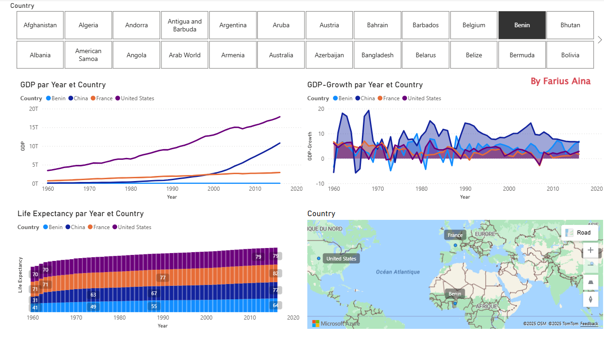
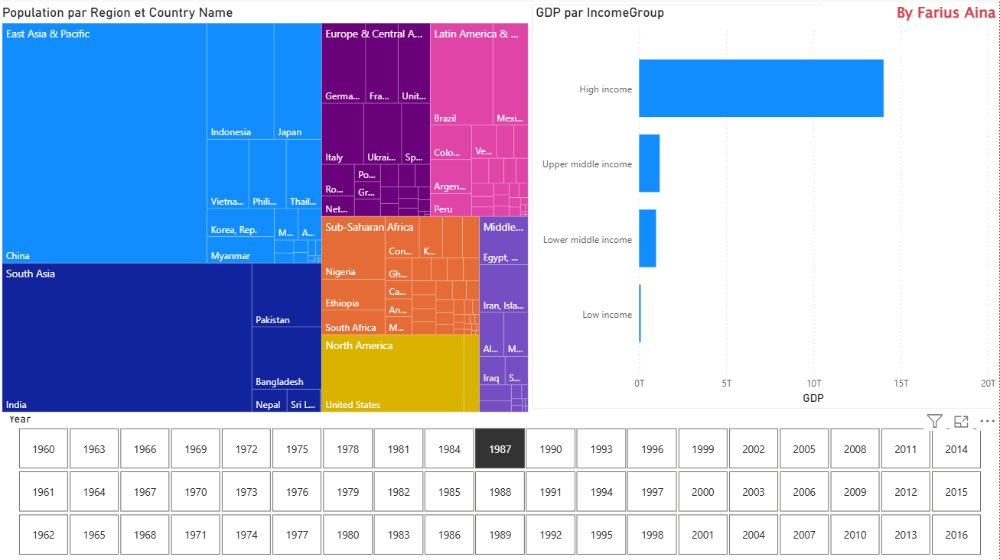
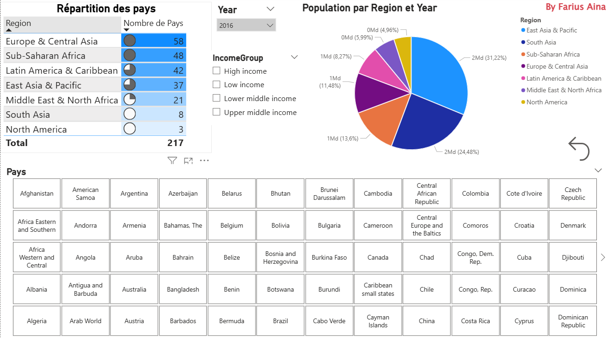

# 📊 Power BI Dashboards

Tous les dashboards ci-dessous ont été réalisés à partir de **données open source** (Banque Mondiale, OCDE, etc.).  

---

## Dashboard 1 – PIB, Croissance et Espérance de Vie
- **Objectif** : analyser le PIB, la croissance et l’espérance de vie pour différents pays (Bénin, Chine, France, États-Unis).  
- **Données** : Banque Mondiale.  
- **Points clés** : utilisation de slicers, courbes d’évolution, cartes géographiques.  

    

---

## Dashboard 2 – Population par Région et Groupes de Revenu
- **Objectif** : comparer la population mondiale par région et analyser le PIB par groupes de revenu.  
- **Données** : Banque Mondiale (Population et World Development Indicators).  
- **Points clés** : treemap interactif, segmentation par groupe de revenu, navigation par années.  

  

---

## Dashboard 3 – Répartition des Pays et Population Régionale
- **Objectif** : analyser la répartition des pays par région et visualiser la population selon les groupes de revenu.  
- **Données** : Banque Mondiale.  
- **Points clés** : tableau dynamique des pays, camembert par région, filtre temporel.  

  
