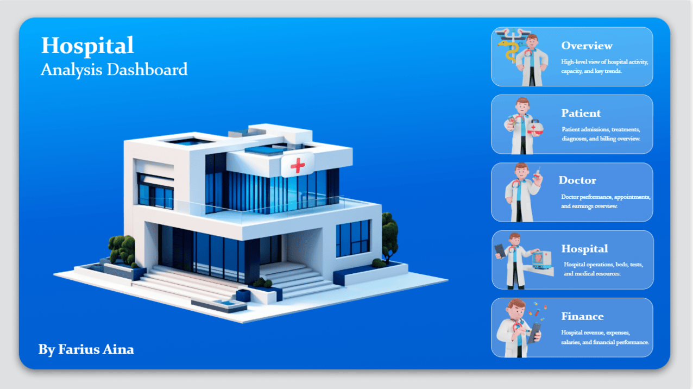
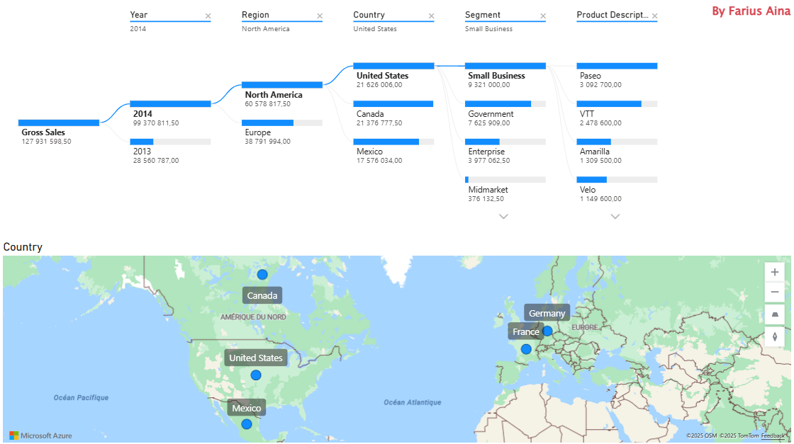

# Data Visualization & Analytics Portfolio

Ce dépôt présente une sélection de projets de **data visualisation**, **data analytics** et **reporting**, réalisés à des fins pédagogiques, analytiques et de portfolio professionnel.

Les projets sont distingués selon leur **nature** :
- **Dashboards de suivi (monitoring)**  
- **Reports analytiques (Power BI)**  

L’ensemble illustre ma capacité à transformer des données brutes en **insights visuels clairs**, structurés et exploitables pour l’aide à la décision, dans des contextes variés.

---

### Hospital Dashboard - Hospital Analysis Dashboard

- **Type** : Dashboard analytique (Power BI)
- **Objectif** : fournir une vue globale et structurée des activités hospitalières afin de soutenir le pilotage opérationnel, médical et financier.
- **Usage** : aide à la décision, suivi de performance, analyse multi-dimensionnelle.
- **Contexte** : projet de data visualisation analytique, conçu comme un cas d’usage métier réaliste.

#### Vues et états du dashboard
- **Overview** : indicateurs clés de capacité hospitalière et tendances globales  
- **Patient** : admissions, traitements, diagnostics et facturation  
- **Doctor** : performance médicale, rendez-vous et revenus associés  
- **Hospital** : lits disponibles, tests, ressources et opérations internes  
- **Finance** : revenus, dépenses, salaires et performance financière  

#### Compétences mises en œuvre
- Modélisation et structuration des données  
- Conception d’un dashboard multi-pages  
- Sélection d’indicateurs adaptés à un contexte métier  
- Data storytelling et lisibilité décisionnelle  

*Aperçu animé du dashboard – navigation entre les différents états*  

---

## Web Dashboard - Weather Monitoring

### Weather Dashboard – Climate & Air Quality Monitoring
- **Type** : Web dashboard (monitoring)
- **Objectif** : fournir une vue synthétique et visuelle des conditions météorologiques et environnementales.
- **Usage** : suivi d’indicateurs, visualisation rapide, aide à la décision à court terme.
- **Contexte** : projet structuré et enrichi à des fins pédagogiques et de démonstration analytique.

#### Indicateurs affichés
- Température actuelle et conditions météo par ville  
- Prévisions multi-jours  
- Humidité, vent, visibilité, pression, UV  
- Qualité de l’air (AQI, PM10, PM2.5, SO₂, NO₂, CO, O₃)  
- Lever et coucher du soleil  
- Probabilité de pluie quotidienne  

---

## Power BI Reports – Data Analysis & Storytelling

Les projets suivants sont des **reports analytiques Power BI**, orientés **exploration des données**, **comparaison**, et **aide à la décision**, à partir de données open source ou de datasets pédagogiques.

---

### Report 1 – PIB, Croissance et Espérance de Vie
- **Objectif** : analyser les relations entre PIB, croissance économique et espérance de vie.
- **Pays étudiés** : Bénin, Chine, France, États-Unis.
- **Source** : Banque Mondiale.
- **Approche** : analyse comparative, visualisation temporelle, filtres interactifs.

---

### Report 2 – Population par Région et Groupes de Revenu
- **Objectif** : étudier la répartition de la population mondiale et les différences selon les groupes de revenu.
- **Source** : Banque Mondiale (WDI).
- **Approche** : segmentation, treemap, analyse temporelle.

---

### Report 3 – Répartition des Pays et Population Régionale
- **Objectif** : analyser la distribution des pays et des populations par région.
- **Source** : Banque Mondiale.
- **Approche** : tableaux analytiques, graphiques circulaires, filtres temporels.

---

### Report 4 – Analyse des Transactions de Ventes (5 pays)
- **Objectif** : analyser les ventes brutes par dimensions géographiques et commerciales.
- **Données** : dataset de ventes factice.
- **Pays** : Allemagne, Canada, États-Unis, France, Mexique.
- **Approche** : analyse multi-niveaux, diagramme en cascade, cartographie.

---

### Report 5 – Analyse des Profits d’une Entreprise Indienne
- **Objectif** : analyser les profits journaliers et détecter tendances et anomalies.
- **Données** : dataset factice.
- **Approche** : séries temporelles, indicateurs statistiques, lecture décisionnelle.

---

## Remarque générale

Ces projets illustrent ma capacité à :
- Transformer des données brutes en **insights visuels clairs**
- Concevoir des dashboards **structurés et orientés décision**
- Adapter les visualisations à des **contextes métiers variés**
- Appliquer des bonnes pratiques de **data visualisation et de storytelling**
- Travailler avec rigueur, transparence et sens analytique

---

## Disclaimer & Usage

Les projets présentés dans ce dépôt sont réalisés à des fins **éducatives**, **analytiques** et de **portfolio professionnel**.

Certains projets peuvent s’inspirer de tutoriels publics, de datasets pédagogiques ou de ressources open source.  
Le travail présenté repose alors sur une **réappropriation**, une **structuration**, une **amélioration** et une **adaptation analytique** des concepts initiaux.

Les données utilisées sont issues de sources ouvertes, pédagogiques ou simulées, sauf mention contraire.  
Les icônes, images et autres assets visuels restent la propriété de leurs auteurs respectifs.

Ce dépôt n’a pas vocation à un usage médical, financier ou opérationnel réel.
