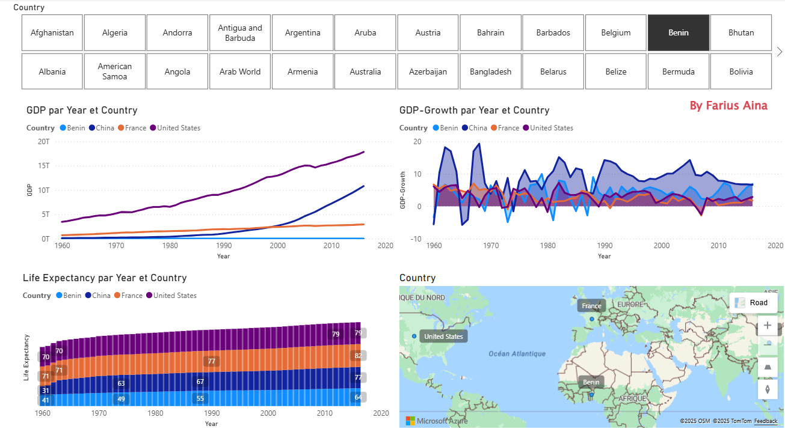
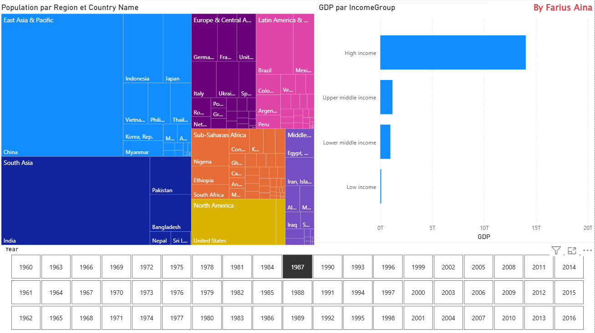
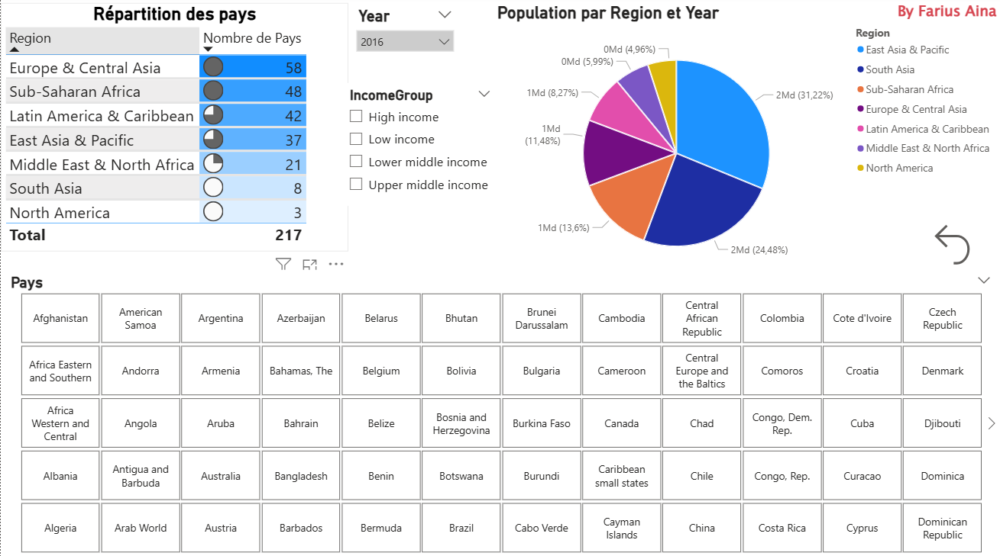
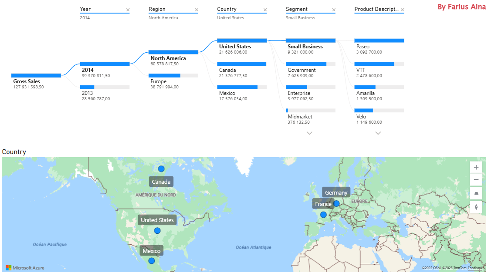
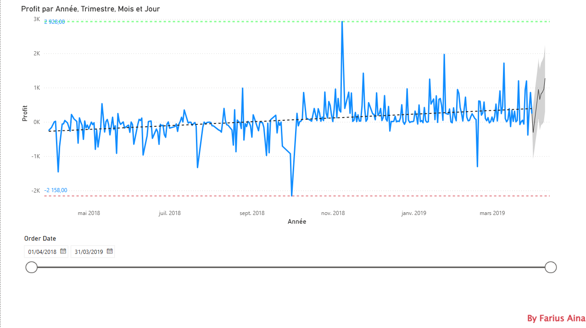

# Power BI Reports - Data Analysis & Storytelling

Cette section présente des rapports Power BI structurés, conçus à des fins d'apprentissage, d'expérimentation et d'exploration analytique.

Ces projets portent sur :

- L'exploration des données
- L'analyse comparative
- Les techniques de visualisation
- L'expérimentation des indicateurs clés de performance (KPI)
- Data Storytelling

---

## Report 1 - PIB, Croissance et Espérance de Vie
- **Objectif** : analyser les relations entre PIB, croissance économique et espérance de vie.
- **Pays étudiés** : Bénin, Chine, France, États-Unis.
- **Source** : Banque Mondiale.
- **Approche** : analyse comparative, visualisation temporelle, filtres interactifs.

---

## Report 2 - Population par Région et Groupes de Revenu
- **Objectif** : étudier la répartition de la population mondiale et les différences selon les groupes de revenu.
- **Source** : Banque Mondiale (WDI).
- **Approche** : segmentation, treemap, analyse temporelle.

---

## Report 3 - Répartition des Pays et Population Régionale
- **Objectif** : analyser la distribution des pays et des populations par région.
- **Source** : Banque Mondiale.
- **Approche** : tableaux analytiques, graphiques circulaires, filtres temporels.

---

## Report 4 - Analyse des Transactions de Ventes (5 pays)
- **Objectif** : analyser les ventes brutes par dimensions géographiques et commerciales.
- **Données** : dataset de ventes factice.
- **Pays** : Allemagne, Canada, États-Unis, France, Mexique.
- **Approche** : analyse multi-niveaux, diagramme en cascade, cartographie.

---

## Report 5 - Analyse des Profits d’une Entreprise Indienne
- **Objectif** : analyser les profits journaliers et détecter tendances et anomalies.
- **Données** : dataset factice.
- **Approche** : séries temporelles, indicateurs statistiques, lecture décisionnelle.

---

⭐ If you find this repository useful, feel free to star it.

