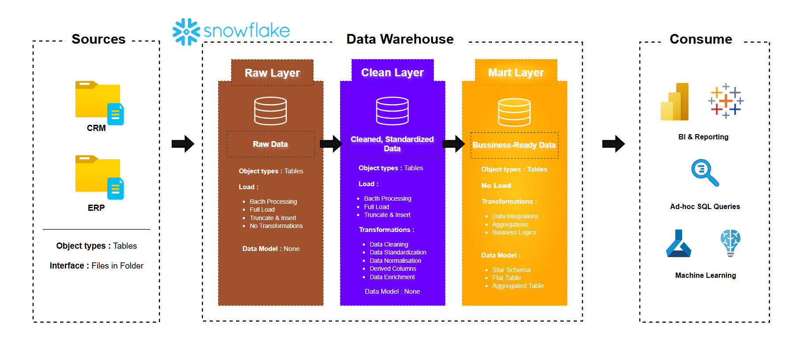
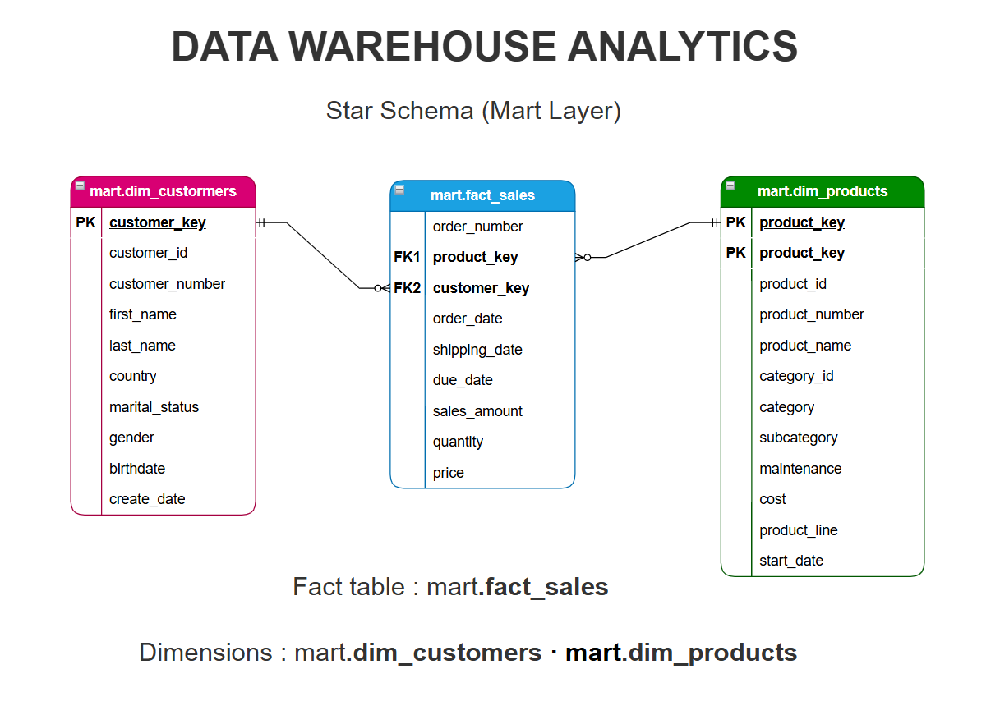

# ❄️ Snowflake Data Warehouse Project

## 📌 Project Overview

This repository presents a cloud-native implementation of the original
[**SQL Server Data Warehouse Project**](https://github.com/Farius0/Formation_Ligne/tree/main/Data%20Warehouse%20Project), redesigned for **Snowflake**.

It reproduces the same layered architecture (**RAW (BRONZE) → CLEAN (SILVER) → MART (GOLD)**)
while leveraging Snowflake-native capabilities such as:

-   Internal stages & `COPY INTO`
-   Streams & Tasks (incremental demo)
-   Role-Based Access Control (RBAC)

The objective is to demonstrate architectural continuity across
platforms while adapting to modern cloud data warehousing patterns.

------------------------------------------------------------------------

# 🏗 Architecture Overview

High-level pipeline:

CRM / ERP CSV\
→ RAW (Landing Layer)\
→ CLEAN (Standardized Layer)\
→ MART (Star Schema)\
→ Analytics / BI

------------------------------------------------------------------------

# 🔄 Layer Description

## 🟫 RAW Layer

-   Preserves source structure (all business fields as STRING)
-   Lineage columns: `load_ts`, `source_file`
-   Loaded using `COPY INTO` from internal stages
-   Full-load pattern (re-runnable)

## 🟪 CLEAN Layer

-   Strong typing using `TRY_TO_NUMBER`, `TRY_TO_DATE`
-   Text normalization (`TRIM`, `NULLIF`)
-   Categorical standardization (gender, marital status)
-   Date validation & range checks
-   Deduplication using `ROW_NUMBER()`
-   Sales consistency logic (amount ≈ quantity × price)

## 🟨 MART Layer (Star Schema)

### Dimensions

-   `mart.dim_customers`
-   `mart.dim_products`

### Fact

-   `mart.fact_sales`

Grain: 1 row per sales order line\
Surrogate keys generated using `MD5()` hash.

------------------------------------------------------------------------

# ⚡ Incremental & Advanced Features

## Streams

-   `RAW.STRM_CRM_SALES_DETAILS`
-   Captures incremental inserts on RAW sales

## Task

-   `CLEAN.TSK_LOAD_SALES_INCREMENTAL`
-   Runs every 6 hours
-   Applies same logic as full CLEAN load

------------------------------------------------------------------------

# 🔐 Role-Based Access Control

  Role               Responsibility
  ------------------ ---------------------------------
  ROLE_DWH_ADMIN     Project administration
  ROLE_DWH_ETL       Load & transform RAW/CLEAN/MART
  ROLE_DWH_ANALYST   Read-only access to MART

Compute separation: - `WH_ETL` - `WH_BI`

------------------------------------------------------------------------

# 🔁 Architecture Comparison (SQL Server vs Snowflake)

  Concept          SQL Server                      Snowflake
  ---------------- ------------------------------- ------------------------------
  Raw Layer        Bronze schema                   RAW schema
  Clean Layer      Silver schema                   CLEAN schema
  Business Layer   Gold schema                     MART schema
  Data Load        BULK INSERT / SSIS              COPY INTO (Internal Stage)
  Orchestration    Stored Procedures / SQL Agent   Streams + Tasks
  Recovery         Backup / Restore                Time Travel
  Security         Database Roles                  RBAC + Warehouses
  Compute          Fixed server resources          Virtual Warehouses (Elastic)

This demonstrates architectural portability across database platforms
while preserving modeling principles.

------------------------------------------------------------------------

# 📁 Repository Structure

├── snowflake/ 
            ├── 00_setup/ 
            ├── 01_ingestion_raw/ 
            ├── 02_transform_clean/
            ├── 03_mart_gold/ 
            ├── 04_incremental/ 
├── datasets/ 
├── docs/ └──
README.md

------------------------------------------------------------------------

# ▶️ Execution Order

1.  00_setup\
2.  01_ingestion_raw\
3.  02_transform_clean\
4.  03_mart_gold\
5.  (Optional) 04_incremental

------------------------------------------------------------------------

# 📊 Analytical Continuity

This project extends into:

👉[Data Warehouse Analytics Project](https://github.com/Farius0/Formation_Ligne/tree/main/Data%20Warehouse%20Analytics)

Together, they simulate a complete BI pipeline: - Data ingestion - Data
warehouse modeling - Analytical transformation - Business reporting

------------------------------------------------------------------------

# 🎯 Skills Demonstrated

-   Cloud Data Warehouse Architecture (Snowflake)
-   ELT design (RAW → CLEAN → MART)
-   Incremental processing (Streams & Tasks)
-   Data Quality Engineering
-   Dimensional Modeling (Star Schema)
-   Cross-platform DWH implementation (SQL Server → Snowflake)
